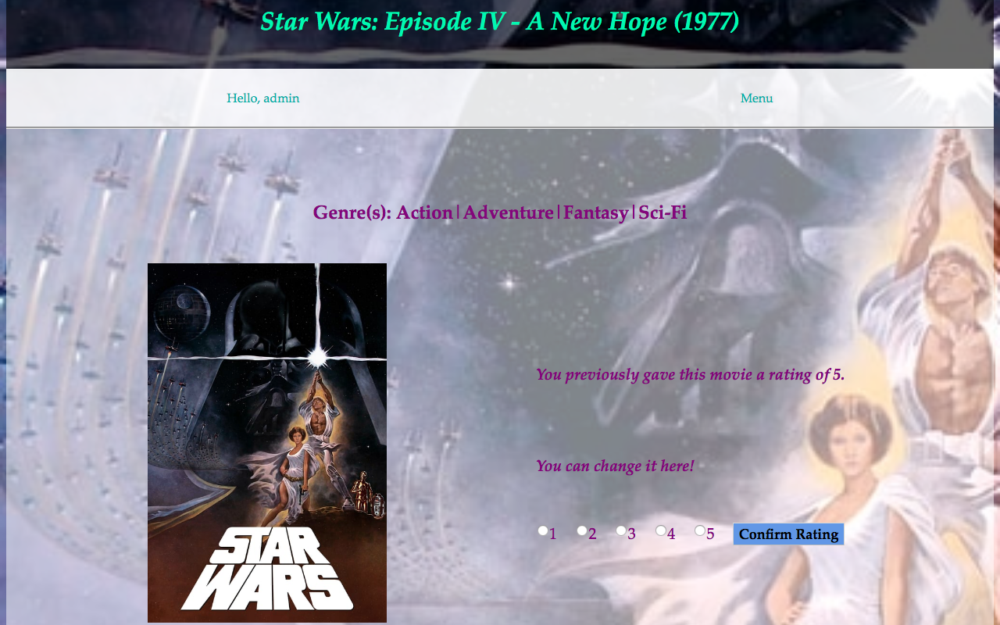

# Movie Recommender
A web application that uses matrix factorization to recommend movies to users. Features include user login, logout, and signup capabilities
This project makes use of the following: Django web framework, SQLite database, MovieLens 1M Dataset, & TMDB API. 


## System Requirements
Software:
```
Python 3+
Django 2.2
```
Python Libraries:
```
Numpy
Scipy
Pandas
```


## Preview
### User Homepage:
Displays the movies rated by and recommended for the user. 
This page can only be accessed if the user is verified and has rated movies. 
The user will be redirected to the index if no movies have been rated yet.


### Index:
Displays all movies stored in the database. The user can sort through the results by genre, title, etc.


### Movie Specifics:
Displays details for a specific movie, and allows the user to rate or modify their rating to the movie.

